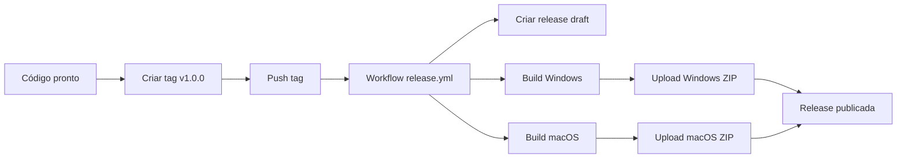

# 🔄 GitHub Actions - Workflows de Build

Este documento explica como funcionam os workflows automatizados do GitHub Actions para gerar executáveis do Procura.

## 📋 Workflows disponíveis

### 1. 🔨 `build.yml` - Build contínuo
**Quando executa:**
- ✅ Push para `main` ou `develop`
- ✅ Pull requests para `main`
- ✅ Criação de releases
- ✅ Execução manual (workflow_dispatch)

**O que faz:**
- Testa o código em Windows e macOS
- Gera executáveis para ambas plataformas
- Sobe artifacts por 30 dias
- Se for uma release, anexa os arquivos automaticamente

### 2. 🚀 `release.yml` - Release automático
**Quando executa:**
- ✅ Criação de tag com prefixo `v*` (ex: `v1.0.0`)

**O que faz:**
- Cria uma release no GitHub
- Gera executáveis para Windows e macOS
- Anexa os arquivos ZIP na release
- Adiciona descrição padronizada

## 🎯 Como usar

### Fazer build manual:
1. Vá para **Actions** no GitHub
2. Selecione **Build Executables**
3. Clique em **Run workflow**
4. Baixe os artifacts gerados

### Criar uma release:
```bash
# Criar e enviar uma tag
git tag v1.0.0
git push origin v1.0.0
```

A release será criada automaticamente com os executáveis!

## 📁 Estrutura dos artifacts

```
📦 Artifacts gerados:
├── procura-windows-{sha}.zip
│   └── Procura.exe                 # Executável Windows
└── procura-macos-{sha}.zip  
    └── Procura.app/               # Bundle macOS
        ├── Contents/
        │   ├── MacOS/Procura
        │   ├── Resources/
        │   └── Info.plist
        └── ...
```

## 🔧 Configurações técnicas

### Matrix Strategy:
- **Windows**: `windows-latest` + Python 3.11
- **macOS**: `macos-latest` + Python 3.11

### Cache:
- Dependencies pip são cachadas para builds mais rápidos
- Cache key baseado no hash do `requiriments.txt`

### Verificações:
- ✅ Verifica se executável foi gerado
- ✅ Lista informações do arquivo
- ✅ Falha o build se não encontrar o executável

## 🚨 Solução de problemas

### Build falha no Windows:
```yaml
# Adicionar debug no workflow:
- name: Debug Windows
  if: failure() && matrix.platform == 'windows'
  run: |
    Get-ChildItem dist/
    Get-Content build/Procura/warn-Procura.txt
```

### Build falha no macOS:
```yaml
# Adicionar debug no workflow:
- name: Debug macOS
  if: failure() && matrix.platform == 'macos'
  run: |
    ls -la dist/
    cat build/Procura/warn-Procura.txt
```

### Dependências faltando:
- Verificar se `requiriments.txt` está correto
- Adicionar módulos em `hiddenimports` no `procura.spec`

### Problemas de permissão:
```yaml
# Para macOS, adicionar permissões:
- name: Fix permissions
  if: matrix.platform == 'macos'
  run: |
    chmod +x dist/Procura.app/Contents/MacOS/Procura
```

## 🔄 Fluxo completo de release



## ⚙️ Personalizar workflows

### Adicionar nova plataforma (Linux):
```yaml
# No build.yml, adicionar na matrix:
- os: ubuntu-latest
  platform: linux
  artifact_name: Procura
  build_path: dist/Procura
```

### Mudar versão do Python:
```yaml
# Alterar em ambos workflows:
- name: Set up Python
  uses: actions/setup-python@v4
  with:
    python-version: '3.12'  # Versão desejada
```

### Adicionar assinatura de código:
```yaml
# Para Windows (precisa certificado):
- name: Sign executable
  if: matrix.platform == 'windows'
  run: |
    signtool sign /f cert.p12 /p ${{ secrets.CERT_PASSWORD }} dist/Procura.exe
```

## 📊 Monitoramento

### Acompanhar builds:
- **Actions tab** no GitHub
- Status badges no README
- Notificações por email (configurável)

### Métricas importantes:
- ⏱️ Tempo de build (goal: <10 min)
- 📦 Tamanho dos executáveis
- ✅ Taxa de sucesso dos builds

## 🎉 Status badges

Adicione no README.md:
```markdown


```

## 📝 Próximos passos

- [ ] Adicionar testes automatizados antes do build
- [ ] Implementar assinatura de código
- [ ] Criar builds para Linux
- [ ] Adicionar notificações de build
- [ ] Implementar deploy automático